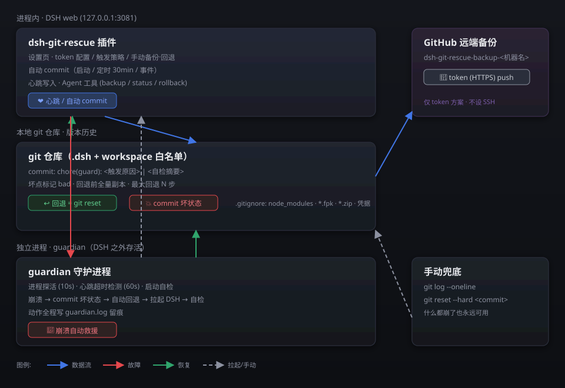

<div align="center">

# 🛟 dsh-git-rescue

**DSH 救援恢复插件**——守护进程 + `.dsh` git 仓库管理 + 远端备份 + 救援环境 + 专项恢复工具。

把 `.dsh` 用户目录（sessions 会话、settings、profiles 配置、skills）纳入 git 版本管理，
用 commit 历史做精细回退；harness 崩溃时由独立守护进程按「专项工具 → git 还原 → 纯净 dsh 协助」三层兜底恢复。
远端备份支持 **GitHub token / SSH key 双方案**。从 2.0.0 起具备版本自动更新（含大版本换代升级）。

> ## 🥇 最好的 dsh 恢复插件，永远是 dsh 本体！
>
> 2026-08-19 崩溃主机救援实战铁律：插件（包括本插件）只能做 git 回退/拉起这类**本机兜底**；
> 真正把一台起不来的 DSH 救回来、把 8 插件 + 上百会话完整恢复的，往往是**另一台还在跑的 DSH**
> （跨机部署救援实例 + SSH 拉起纯净环境 + 可覆盖式恢复包）。本机插件救不了的场景，永远记得：
> **再开一个 DSH 来救这个 DSH**——训练有素的 AI + 另一份 .dsh + 一份权威 skill 文档，比任何单个插件都可靠。

**功能总览**（当前 2.1.0）：

| 功能 | 版本 | 一句话 |
|------|------|--------|
| .dsh 单仓库管理 | v2.0.0 | `.dsh` 本地 git 仓库（会话/skill 不因启动失败丢失），自动 commit、心跳、崩溃检测 |
| 远端备份 | v2.0.0 | **GitHub token / SSH key 双方案**，私有仓名 **固定 `dsh-git-rescue-backup`**（2026-08-21 用户决定，设备 ID 作仓库内文件夹） |
| 开机自启守护进程 | v2.0.0 | 启动命令在 `.dsh` 目录这一层（git 仓库根），写系统自启 |
| 救援环境 | v2.1.0 | `<dsh版本>@Save-clean`（纯净，防装插件锁定）+ `<dsh版本>@Save-test`（测试），**命名代码写死**（rescue-env.js rescueEnvName 统一生成） |
| 专项恢复工具 | v2.0.0 | 代码级诊断修复：plugin_config / boot_symlink / ro_volume / plugin_load / permission / session_repair（**救援链第一优先级**） |
| LLM 自治修复 | v2.1.0 | guardian 直连 LLM 分析根因 + 白名单动作（**救援链第二优先级，优先于 git 回退**） |
| git 还原恢复 | v2.1.0 | **最后兜底（2026-08-21 用户要求降优先）**：自带模块/LLM 都失败才 git 覆盖；故障分类 → 保留现场 → 坏点标记 → reset 到好提交 → 拉起 → 自检 |
| 纯净 dsh 协助兜底 | v2.0.0 | 无法恢复时唤起 Save-clean，纯净 dsh 加载插件 skills 目录协助 |
| **自动更新** | v2.0.0 | 强制跟随 GitHub 最新稳定版 + **大版本换代升级**（卸载旧版→安装新版，代码级判断） |
| guardian 守护 | v2.0.0 | 独立进程探活 + git 回退（最后兜底）+ 拉起 + 自检（坏点标记防死循环）+ OOM 防护 + peak-resume |
| 插件树健康体检 | 合并自旧版 | plugin-health：声明/产物一致性检查（00:22 崩溃类型），拉起前自动修复 |
| 会话恢复联动 | 合并自旧版 | 崩溃后自动调 session-manager 续跑中断会话（装了才调）**+ 自动续跑全局闸门**：DSH 刚启动默认关闭续跑（防崩溃恢复后批量建空壳），用户手动开启或第一次手动对话后自动放行 |
| 接管式重启 | 合并自旧版 | 独立脚本 TERM→轮询恢复→验证，会话中断也能安全完成 |
| 救援积分 / sudo-key / flapping / 现场捕获 | 合并评估 | 旧版能力按重构规范评估后纳入 |
| **目录结构查看（dir-tree）** | v2.0.0 | 独立工具 `tools/dir-tree.mjs`：零依赖、全平台兼容 Node.js（不依赖 shell tree），默认只列目录 2 层（项目文件夹那一层），可 CLI 运行或 import 调用（详见 `skills/dsh-dir-tree.md`） |



</div>

---

## ✨ 为什么需要它？

DeepSeek Harness 改配置、装插件、跑长任务都是家常便饭，风险也随之而来：

- 😱 **改崩了** —— `cordis.patch.yml` 写错、插件冲突，DSH 启动失败白屏
- 😱 **会话丢了** —— sessions 目录误删/损坏，几天的对话留档没了
- 😱 **反复改反复崩** —— 不知道回退到哪一步才是好的，只能凭记忆重做
- 😱 **单机无备份** —— 机器坏了/重装，全部配置与工作留档烟消云散

**dsh-git-rescue 的思路：一切历史都是 git 历史。** 版本管理交给 git，救援恢复就是回退，
远端备份交给 GitHub（token/SSH）。与现有的 zip 快照方案（dsh-snapshot-guardian）互补：

| 方案 | 手段 | 特点 | 适用 |
|------|------|------|------|
| dsh-snapshot-guardian | zip 全量快照 + 解压恢复 | 零依赖、快照间无关联、恢复 = 解压 | 启动失败/网页崩了的手动兜底 |
| **dsh-git-rescue（本插件）** | git 增量历史 + commit 回退 | 可 diff、可溯源、自动触发、可远端备份 | 日常版本管理 + 崩溃自动恢复 |

---

## 🧭 设计原理

### 原理一：版本管理 = `.dsh` git 仓库 + 自动 commit

| 管理对象 | 路径 | 说明 |
|----------|------|------|
| 用户目录 | `.dsh/`（`settings.yaml`、`profiles/`、`sessions/`、`storages/`、`skills/`） | DSH 全部可编辑状态（**2.0.0 单仓库，workspace 不再纳入**） |

**触发时机**（任一命中即 commit）：
- 🚀 启动时（恢复现场，记录"上次结束时长什么样"）
- 💥 崩溃检测到时（先记坏状态，再谈回退）
- ⏱️ 定时（默认每 30 分钟，可配置）
- 👆 手动（设置页一键备份）

**commit 规范**：`chore(guard): <触发原因> | <自检摘要>`，例如
`chore(guard): crash-detected | pre-rollback snapshot of broken state` —— 每个 commit 都能回溯"当时发生了什么"。

**入库边界**（安全第一）：
- ❌ 凭据永不入库：`.credentials.yaml`、`.env`、`.anonymous-user-id`、`git-rescue/`（token/heartbeat/events）
- ❌ 大文件不入库：`node_modules/`、`profiles/*/node_modules/`
- ⚠️ sessions/storages 为 zstd 压缩二进制 → **定期全量基线 + 常规增量排除**（默认每天一次基线）
- ✅ `.gitignore` 规则由插件首次初始化时自动生成并提交

### 原理二：救援恢复 = 自带模块修复 → LLM 修复 → git 回退（最后兜底）→ 纯净协助（2026-08-21 优先级调整）

> ⚠️ **git 回退优先级最低（2026-08-21 用户确立）**：崩溃救援**不优先 git 覆盖**——先由自带功能模块直接修复，再 LLM 自治修复，git 回退只作最后兜底；仍失败才唤起纯净环境协助。避免"一崩就 git 覆盖"把最近的配置/插件改动冲掉。

```
崩溃检测 → ① 故障分类（系统/引导/插件/数据）
        → ② 自带功能模块直接修复（⑤，专项恢复工具：plugin_config / boot_symlink / ro_volume / plugin_load / permission / session_repair，修复后探活）
        → ③ 不能修复 → LLM 自治修复（⑥，guardian 直连 LLM 分析根因 + 白名单动作，恢复健康即成功返回）
        → ④ 仍不能修复 → git 回退（⑦，最后兜底：保留坏现场 commit → 坏点标记 → reset 到最后一个好提交）
        → ⑤ 重启 DSH → 健康自检
        → ⑥ 仍失败 → 告知用户在纯净环境自行修复（⑧，唤起纯净 dsh 加载 skills 协助）
```

- **坏点标记**：回退过的 commit 打 `bad` 标记，防止"回退后又回到同一个坏点"的死循环
- **回退动作可逆**：回退前有全量副本，误回退也能再恢复
- **LLM 修复优先于 git 回退**：guardian 直连 DeepSeek API 分析根因，白名单动作（report_only / suggest_restart / suggest_config_fix / suggest_git_reset）自动执行后探活——恢复健康即成功，**不 git 覆盖**；git 回退仅当 LLM 也失败时兜底
- **救援环境命名（代码写死）**：测试环境 `<dsh版本>@Save-test`、纯净环境 `<dsh版本>@Save-clean`，由 `lib/rescue-env.js` 的 `rescueEnvName` 统一生成，不再使用 dsh-test-home 等历史命名

### 原理三：远端备份 = GitHub + token / SSH key 双方案

- 🔑 **认证双方案**（任一可用）：
  1. **SSH key 优先**（`~/.ssh/id_*`）：本地 git remote + push，走 git 原生 SSH 传输
  2. **GitHub token 兜底**：REST API 快照推送（`git-remote-https` 缺失环境仍可用）
- 🔒 **token 只存本地**，权限 `600`，绝不写入任何 commit；仅用于 push 认证
- ⚠️ **环境自检**：初始化时检测系统 git 是否可用。已知坑：本机 git 缺少 `git-remote-https` 助手，HTTPS git 操作直接失败 —— 插件检测到该情况时**自动降级为 GitHub REST API 直连**
- ☁️ **远端仓库名**：**固定 `dsh-git-rescue-backup`**（2026-08-21 用户决定，不含设备ID）；设备 ID 作仓库内文件夹（`<设备ID>/profiles, sessions, skills, settings.yaml`），多设备共用一仓互不干扰（GitHub 不允许 `.` 开头的历史 `.dsh@...` 方案已弃用）
- 🪪 **设备身份 = 设备稳定指纹，不是主机名**：默认基于 `/etc/machine-id`（Linux 系统级唯一 ID，兜底为持久化 UUID）；dsh 版本由守护进程读取主实例 `@deepseek-ai/dsh` 包版本

### 原理四：崩溃检测与自动回退

| 检测手段 | 判定 | 说明 |
|----------|------|------|
| 进程探活 | dsh web 进程消失 | guardian 独立进程周期探活（每 10s） |
| 心跳文件 | 心跳超时（默认 60s） | DSH 内插件定期写心跳，guardian 读 |
| 启动自检 | 端口未监听 / 白屏 / 插件未加载 | 重启后健康检查不通过 = 判定为坏状态 |

检测到崩溃 → 走原理二的三层兜底流程 → 回退后自动拉起 DSH → 自检通过则通知恢复完成。

---

## 🔄 工作流程总览

```
┌─────────────┐   ┌──────────────────────────┐   ┌─────────────────┐
│  DSH 启动    │──▶│ ① 检测运行机器有无 git     │──▶│ ② 检查插件配置   │
└─────────────┘   │    (git --version)        │   │    (token/SSH)  │
                  └──────────────────────────┘   └────────┬────────┘
                                                          ▼
                  ┌─────────────────────────────────────────────┐
                  │ ③ 初始化 .dsh git 仓库 + .gitignore + 首 commit │
                  └─────────────────────────────────────────────┘
                                                          │
                  ┌───────────────┐   每 30min / 事件触发    ▼
                  │ ④ 自动 commit  ◀───────────────────── 版本快照
                  └───────┬───────┘
                          │
                  ┌───────▼───────┐   push (token/SSH)   ┌──────────────────┐
                  │ ⑤ 远端备份     │────────────────────▶│ GitHub 私有库      │
                  └───────┬───────┘   dsh-git-rescue-backup│ 私有仓（固定名）│
                          │                              └──────────────────┘
                  ┌───────▼───────┐
                  │ ⑥ 崩溃监控     │──崩溃?──▶ ⑦ 故障分类 → ⑧ 自带模块修复（专项工具）
                  └───────────────┘        → ⑨ LLM 自治修复 → ⑩ git 回退（最后兜底）
                                           → ⑪ 拉起自检 → ⑫ 失败? → ⑬ 唤起纯净环境协助
```

---

## 📦 组件规划

### 组件一：dsh-git-rescue 插件（DSH 进程内，2.0.0 单组件根级结构）

```
dsh-git-rescue/
├── package.json              # 2.0.0
├── cordis.patch.yml          # 插件注册（bundle patch 自注册）
├── lib/
│   ├── index.js              # 插件入口（API + Agent 工具）
│   ├── git.js / github.js / device.js    # git 管理 + 远端备份 + 设备识别
│   ├── probe.js / flapping.js / process-capture.js / fault-classify.js
│   ├── rescue-env.js         # 救援环境（<版本>@Save-clean / @Save-test）
│   ├── save-lock.js          # 纯净环境防装插件锁定
│   ├── repair-tools.js       # 专项恢复工具（⑤，6 个工具）
│   ├── plugin-health.js      # 插件树健康体检（合并自旧版）
│   ├── session-link.js       # 会话恢复联动（合并自旧版）
│   ├── boot-startup.js       # 开机自启（③）
│   └── self-update.js        # 自动更新 + 大版本换代升级
├── guardian/
│   ├── server.js             # 独立守护进程（②-⑦ 全部）
│   ├── guardian-boot.sh      # 开机自启脚本
│   └── public/               # 控制台网页（含 token/SSH 配置面板）
├── skills/                   # 插件 skill 档案（含联动契约）
├── tools/
│   └── dir-tree.mjs          # 独立目录结构查看工具（零依赖、全平台兼容 Node.js）
├── docs/
│   ├── harness-startup-failure-log.md   # ⭐ 启动失败原因/解决方案（按类型）
│   └── screenshots/architecture.svg     # 体系架构图
└── test-git-rescue.mjs       # 单测
```

**Agent 工具**：`git_rescue_status` / `git_rescue_init` / `git_rescue_backup` / `git_rescue_log` / `git_rescue_rollback` / `git_rescue_push` / `git_rescue_restart` / `git_rescue_repair` / `git_rescue_rescue_env` / `git_rescue_boot_autostart` / `git_rescue_link_recovery`

### 组件二：guardian 独立进程

- **为什么独立？** 网页崩了恢复按钮就没了 —— 监控与回退必须活在 DSH 之外
- 周期探活 + 崩溃自动救援（专项工具 → git 回退 → 拉起）+ 纯净环境唤起
- **OOM 防护**：拉起 DSH 时带 `NODE_OPTIONS=--max-old-space-size=4096`（2026-08-20 教训）
- **peak-resume**：救援成功后自动恢复高峰暂停的自动续跑（**受自动续跑全局闸门约束**：闸门 closed 时不恢复，等用户手动对话后放行）
- **自动续跑闸门**：DSH 恢复健康时置 `autoContinueGate=closed`（防批量建空壳），用户手动开启或第一次手动对话后放行（联动 dsh-session-manager，见「联动与源码地址」）
- **插件树体检**：git 回退后、拉起前自动修复带病插件（合并自旧版）
- 网页（默认 3082）：状态 / 手动控制 / **🔑 远端认证配置（token/SSH）** / git 历史 / 日志

### 组件三：手动兜底（零依赖）

- 什么都不装也能用：`cd ~/.dsh && git log --oneline`、`git reset --hard <commit>`
- 崩溃到连 guardian 都起不来时，命令行 git 就是最后一张网

---

## 🔒 安全边界

| 条目 | 约定 |
|------|------|
| token 存储 | 本地文件 600 权限（data/sensitive/），仅 push 用，绝不提交 |
| 远端仓库 | 只含版本历史与快照，不含任何凭据明文 |
| 回退安全 | 回退前全量副本 + 坏点标记 + 最大回退步数 |
| 大文件 | 一律 gitignore，仓库只保留文本/配置/小体积留档 |
| 纯净环境保护 | Save-clean 环境拒绝插件注册（防救援基线被破坏） |
| sudo-key | 完全可选，绝不明文显示/存储；不填不影响核心功能 |
| 大版本升级 | 卸载旧版→安装新版（带备份回滚），不直接覆盖 |

---

## 📚 设计理念

1. **历史即资产**：凡是 DSH 可编辑的状态都进 git，丢了的都能找回来
2. **回退是最终手段，也是自动手段**：手动可回、守护可回、崩溃自动回
3. **token/SSH 双方案、环境自检**：环境不对劲时自动降级，不把鸡蛋放一个篮子里
4. **三层网互不依赖**：专项工具（简单修复）→ git 还原（⑥）→ 纯净 dsh（⑦），每层独立可救
5. **功能完备性**：一项功能不只能靠 skill 或只靠代码——缺哪补哪（skill-code-parity）

---

## 🧪 测试结果（2026-08-20，测试实例 3083 实测）

- [x] 插件加载：version=2.0.0、backupRepo=dsh-git-rescue-backup、心跳正常
- [x] .dsh 仓库 init：git init + .gitignore + 基线 commit
- [x] 破坏测试 5/5：篡改配置 / 删文件 / 连环破坏 / kill -9 / 灭门级（cordis.patch.yml 致崩）
- [x] guardian 自动救援 e2e：破坏致无法启动 → 专项工具/git 回退 → 拉起 → 自检通过
- [x] 坏点标记：回退后再次崩溃不会回到同一 commit（bad-* tag 实测）
- [x] 专项工具：plugin_config/boot_symlink/ro_volume/plugin_load/permission/session_repair 诊断命中
- [x] 救援环境：Save-clean 防装插件锁定（拒绝他插件、救援插件放行）
- [x] 代码级修复：OOM 防护 / chown 权限 / import 冒烟（T10）/ corrupt session（session_repair）/ peak-resume
- [x] 自更新：majorUpgrade 大版本换代判定（结构不同=大版本+1，旧结构不自动更新）

## 🧪 测试体系：不测"正常"，专测"搞破坏"

> 救援工具的信任来自反面测试。我们不信"应该没问题"，而是**故意把它弄坏，再让它自己爬起来**——
> 这是本项目的核心测试哲学，也是它敢自称"救援"的底气。

### 破坏矩阵（5 类真实破坏，全部实测通过 ✅）

| # | 破坏手段 | 破坏对象 | 验证的救援能力 | 结果 |
|---|----------|----------|----------------|------|
| 1 | 篡改配置 | `settings.yaml` 写入垃圾 | git 回退恢复原状 | ✅ |
| 2 | 删除文件 | 删除被跟踪的 `.gitignore` | 回退找回文件 | ✅ |
| 3 | 连环破坏 | 恢复后**再次**破坏 | bad 标记防回退死循环 | ✅ |
| 4 | 进程秒杀 | `kill -9` dsh web | guardian 心跳检出 + 自动拉起 | ✅ |
| 5 | 灭门级 | `cordis.patch.yml` 引用缺失插件致无法启动 | 事故识别 + 专项工具/git 回退 + 拉起 + 自检 | ✅ |

### 灭门级测试的完整时间线（真实日志节选）

```
10:21:44  健康检查失败（连续 1/3）
10:21:54  健康检查失败（连续 2/3）
10:22:04  健康检查失败（连续 3/3）→ 触发自动救援
10:22:04  坏点标记: bad-c6a588b            ← 坏提交被标记，防再次踩坑
10:22:04  已回退到 bd6824c（from c6a588b） ← git reset --hard 秒级完成
10:22:04  启动 DSH: <自动拉起命令>
10:22:09  ✅ 救援成功：回退后 DSH 恢复正常  ← 5 秒内满血复活
```

**为什么值得"吹"**：
- **留证**：每次破坏都会留下一个可事后分析的坏提交（pre-rollback snapshot）——不只救回来，还保留完整现场供复盘
- **防死循环**：坏点标记（`bad-*` tag）保证"回退后再次崩溃不会回到同一个坏点"
- **可复现**：整套破坏流程跑在一次性测试实例上，任何人想验证都能安全重放，不碰生产数据

### 独立测试环境：测试随便崩，生产不动摇

```
┌─ 主实例（生产/会话）────────────────────────┐
│  dsh web  127.0.0.1:3081   DSH_HOME=~/.dsh  │
└──────────────────────────────────────────────┘
┌─ 测试实例（插件热开发，随便崩）───────────────┐
│  DSH_HOME=workspace/dsh-test-home（完全隔离）│
│  └ 反代 0.0.0.0:3084（局域网访问）           │
└──────────────────────────────────────────────┘
```

---

## 🌐 平台能力（2.0.0，代码实证判断）

| 能力 | Linux | Windows | macOS |
|------|:-----:|:-------:|:-----:|
| git 管理 / 远端备份 / 自动更新 | ✅ | ✅ | ✅ |
| 心跳 / 探活 / 现场捕获（stderr） | ✅ | ✅ | ✅ |
| 专项工具（plugin_config/boot_symlink/plugin_load/session_repair） | ✅ | ✅ | ✅ |
| 设备识别（machine-id） | ✅ | ⚠️ UUID 兜底 | ⚠️ UUID 兜底 |
| guardian 守护（进程/端口/拉起） | ✅ | ⚠️ | ⚠️ |
| 系统修复（ro_volume/permission） | ✅ | ❌ | ⚠️ |
| 救援环境启动（setsid/bash） | ✅ | ❌ | ⚠️ |
| 开机自启（rc.local） | ✅ | ❌ | ⚠️ |

> 完整判断见 `dsh-git-rescue-平台能力判断-20260820.md`。核心救援（git 回退/专项工具/探活）三平台可用；
> 系统级救援（守护/自启/救援环境/权限修复）Linux 完整、Windows 缺失、macOS 部分——非 Linux 均 try-catch 降级不崩溃。

---

## ✅ 三合一合并（历史，已完成）

**结果**：三个原独立仓库（`dsh-snapshot-archive` / `dsh-guardian` / `dsh-snapshot-guardian`）已并入本仓库并从 GitHub 删除。

| 合并来源 | 归入位置 | 状态 |
|----------|----------|------|
| zip 快照归档 | `components/snapshot-archive/`（组件 A） | ✅ 已合并 |
| 守护进程 | `components/guardian/`（组件 B） | ✅ 已合并 |
| git 版本管理+救援 | `components/git-rescue/`（组件 C） | ✅ v1.2.0 已开发完成 |

## ✅ 2.0.0 重构合并（2026-08-20，当前）

**以 2.0.0 重构版为基底**，合并旧版救援功能（守护进程为重点）：

| 合并项 | 状态 |
|--------|------|
| plugin-health（插件树健康体检） | ✅ 已合并（lib/plugin-health.js + guardian/index 接入） |
| session-link（会话恢复联动） | ✅ 已合并（lib/session-link.js + 契约 skill.session-manager.md） |
| **自动续跑全局闸门**（guardian ⇄ session-manager 联动） | ✅ 已实现（2026-08-20）：guardian 恢复健康置 closed，用户手动对话自动 open；session-manager 侧 `autoContinueGate` 字段 + `auto-continue-gate` API；详见「联动与源码地址」 |
| 接管式重启 | ✅ 保留（takeoverRestart） |
| 自动更新（大版本卸载重装） | ✅ 2.0.0 起具备 + majorUpgrade |
| **Windows 平台守护进程适配** | ✅ 已实现（2026-08-20）：findDshPid 用 PowerShell Get-CimInstance、findProxyPid 用 netstat -ano、stopDsh 用 taskkill、启动路径 win32 分支；启动用 CMD（见 windows-process-cmd-start skill） |
| **guardian 开启 SSH 功能** | ✅ 已实现（2026-08-20）：`POST /api/ssh/enable` + `lib/ssh-enable.js`——Windows 自动装 OpenSSH Server + 启 sshd 服务 + 防火墙放行 22（幂等，非 Windows 返回 noop）；免手动跑脚本 |
| **管理员密码提权** | ✅ 已实现（2026-08-20）：guardian 网页「管理员密码」面板 → 存 `data/sensitive/admin-password`（600、不进 git）→ `POST /api/ssh/enable` 自动用密码提权（Start-Process -Verb RunAs 语义，免 UAC 弹窗）；`GET/POST /api/admin-password`（设置/状态/清除） |
| **web 多选备份（会话/skill 定向备份）** | ✅ 已实现（2026-08-20）：guardian 网页用 `tools/dir-tree.mjs` 生成目录树供多选（目录级）→ 勾选存 `backup-select.json`（可复用）→ **git 本地按勾选写 .gitignore**（反向白名单 `*`+`!` 逐级放行）→ **git 远端按勾选推送**（`git add -f` 选中 → commit → push 备份仓）；实测会话A推/会话B排除 ✅ |
| **插件安装门禁（测试闸门代码化）** | ✅ 已实现（2026-08-20）：① 检测插件安装（扫描 cordis.patch.yml vs registry）② 复制新插件 skills/ 到 `.dsh/skills/` ③ `git-rescue/plugin-registry.json` 记录测试状态 ④ **未测试插件阻止主环境重启**（`/api/start` 返回 403 强行接管）⑤ 测试通过更新 registry 放行；存量插件默认放行（不误拦）；`/api/plugin-gate`（状态）+ `/api/plugin-gate/scan` + `/api/plugin-gate/pass` |
| **web 快照面板（git 快照）** | ⏳ 待办（2026-08-20 EIGHTfs 提出，源自旧版「创建快照」入口）：新版 web 加「快照」面板——**手动创建快照 = git commit**（`chore(snapshot): manual`）、**快照列表 = git 提交历史**、**恢复 = git 回退**；不引入 zip 插件，与新版 git 体系一致 |
| **远端备份库 web 入口** | ✅ 已实现（2026-08-21，P2-2）：guardian 网页新增「📦 远端备份库」卡片——显示仓库名（`dsh-git-rescue-backup`）、认证方式（token/SSH/未配置）、最近推送记录（时间/commit/文件数/方法）；**「立即推送」按钮**触发 `pushSnapshot`；每 5s 自动刷新状态 |

## 📜 版本记录（旧版谱系 1.x，保留自 v1.13.0 README）

> X.Y.Z 语义：功能序号.修复次数。旧版为 components/git-rescue 单组件结构；2.0.0 起为根级单组件结构。

| 版本 | 说明 |
|------|------|
| 1.13.0 | 功能13：3080 代理守护（guardian 探测 proxy 进程缺失自动拉起，GUARDIAN_PROXY_ENABLED=0 可关）+ 联动契约 skill（linkage/rescue-env-write/skill.git-push） |
| 1.12.0 | 功能12：救援前插件自更新（guardian recover 开始前先 checkForUpdate，有新版则 applyUpdate 换新磁盘代码再救援——救援逻辑本身保持最新，避免旧版带病救人；测试环境同样允许，自更新≠自动救援；GUARDIAN_SELF_UPDATE=0 可关；任何失败不阻断救援 fail-soft；status 暴露 selfUpdate 开关） |
| 1.11.0 | 功能11：测试环境不自动救援（guardian 探测 DSH_HOME 为 dsh-test-* 即禁用自动 git 回退/拉起，插件崩溃由开发者自行解决，现场保留 + 冷却）+ 活跃对话保护（救援前检测 running\|\|continueRunning，存在则落盘 restart-request.json 提交重启申请，不打断对话）+ 手动救援前记录近期变动文件（pre-restart-changes-*.json，默认 10 分钟窗口，防回退丢开发者刚写的文件） |
| 1.10.0 | 功能10：测试环境路径判定（status.self.isTest，DSH_HOME 含 dsh-test-*）+ 沙盒环境能力检测（lib/sandbox.js：NoNewPrivs/CapEff/sudo 可行性/只读挂载，status 暴露 sandbox 字段） |
| 1.9.0 | 功能9：测试环境入口整合（原 dsh-test-env-entry：侧边栏面板 + /api/dsh-test-env/*） |
| 1.8.0 | 功能8：可选 sudo-key（插件配置，绝不明文显示/存储）——系统故障时 guardian 自动 remount rw 修复；无 root 环境不配置则保持"告警人工" |
| 1.7.2 | 修复（严重/P0）：guardian 故障分类——系统只读/引导软链冲突判定为不可回退（停止无意义回退重启，防无限重启），仅插件配置变更才走 git 回退 |
| 1.7.1 | 修复：guardian 插件安装事故识别（救援时 diff 插件配置，标注疑似装插件崩溃）+ 开机自启脚本 |
| 1.7.0 | 功能7：救援积分（事件流权威防刷分，设备 ID 标识，未来排行榜） |
| 1.6.0 | 功能6：异常感知增强——flapping 检测（无限重启识别+冷却）/ 业务就绪探活（假活识别）/ 现场捕获（stderr 落盘+TERM 追踪）/ sessions 基线+增量策略 |
| 1.5.1 | 修复（严重）：接管式重启增加「超时后主动拉起」——手动启动的实例（如测试实例 dsh-test-instance.sh）kill 后无自动重拉，60s 未恢复则执行 DSH_START_CMD（默认测试实例脚本）主动拉起，再轮询 240s |
| 1.5.0 | 功能5：会话恢复联动（session-manager 装了才调用 scan 续跑，没装跳过，不内置） |
| 1.4.1 | 修复（严重）：接管式重启脚本不再 kill -9 runner（SIGKILL 触发 s6 退避，重拉延迟 15s→4min），只发 TERM；轮询窗口 150s→240s |
| 1.4.0 | 功能4：接管式重启（独立脚本重启+验证，规避会话中断；配套 skill 档案） |
| 1.3.0 | 功能3：自动更新（强制跟随 GitHub 最新稳定版，隐藏开关 env 可关） |
| 1.2.2 | 修复：工具注册补 parameters（Agent 调用 git_rescue_* 整轮失败） |
| 1.2.1 | 修复：备份仓名改用设备稳定指纹（machine-id），不再依赖主机名 |
| 1.2.0 | 功能2 guardian 独立救援进程 |
| 1.1.0 | 功能1 git 版本管理插件本体 |

> 开发期修复的 bug（webServer 注册签名、tools output schema、bad 标记顺序、空仓 seed、ref 更新、软链推送）计入功能实现本身，Z 从发布后修复开始计数。

## ✅ 2.1.0 合并（2026-08-21，v1.13.0 ⇄ v2.0.0 功能合并）

**策略（用户确立）**：以 v2.0.0 重构版为代码基底，按重构同款要求把旧版 v1.13.0 独有功能合并回来；README 以旧版为底保留图文/架构图/分版本功能表，再追加重构版内容。

| 合并项 | 来源 | 状态 |
|--------|------|------|
| 救援积分（scores.js） | v1.13.0 独有 | ✅ 已合并（lib/scores.js，事件流权威防刷分，status 暴露 scores） |
| 沙盒能力检测（sandbox.js） | v1.13.0 独有 | ✅ 已合并（lib/sandbox.js：NoNewPrivs/CapEff/sudo/只读挂载，status 暴露 sandbox） |
| 会话恢复联动（linkSessionRecovery） | v1.13.0 独有 | ✅ 已合并（崩溃检测后自动 scan 续跑 + POST /api/git-rescue/link-session-recovery + git_rescue_link_recovery 工具；session-link.js 两版一致直接复用） |
| 测试环境保护（test-home.js） | v1.11.0 独有（v2.0.0 误删） | ✅ 已修复（2026-08-21 上午：补回 isTestHomePath + guardian IS_TEST_HOME 闸门——测试实例崩溃不再误触发 git 回退全还原） |
| 版本记录表（1.x 谱系） | v1.13.0 README | ✅ 已并入（见上节） |
| 自更新卸载重装 | v2.0.0 已有 | ✅ 强化（代码级数据结构一致性判断：同大版本严重不一致也走 applyMajorUpgrade 卸载重装） |
| **旧版迁移桥（v1.13.x → v2.x）** | 2026-08-21 新增 | ✅ v1.13.0 部署版 self-update 已加固：旧路径 `components/git-rescue/package.json` 404 时探测根级 → structureMismatch → **卸载重装**（整目录备份→清空→新结构原子就位→失败回滚）；端到端实测 1.13.0→2.1.0 成功 |

**版本号**：合并后大版本数据结构未变（仍根级结构）→ 保持 2.x 线，本次合并为 2.1.0。

## ✅ 2.2.0 还原策略改进（2026-08-21 用户确立：还原只还原 profile）

**问题**：guardian/手动回退原用 `git reset --hard` 全量回退整个 .dsh，而 `sessions/`（131 文件，历史 force-add）与 `.credentials.yaml` 曾被跟踪 → 崩溃救援会把会话数据一并覆盖还原（「测试环境触发救援全还原」的深层原因之一）。

**改进**：

| 项 | 说明 |
|----|------|
| `restoreProfileOnly` | 只 checkout 配置类路径（profiles / settings.yaml / skills / .gitignore / .anonymous-user-id / session-transfer）回好提交；数据目录完全不触碰 |
| `untrackDataDirs` + `DATA_DIRS` | sessions/storages/snapshot-archive/git-rescue/.credentials.yaml 从 git 索引移除（工作区文件保留），防 reset/checkout 覆盖；.gitignore 幂等补全覆盖 |
| guardian recover | 主恢复路径 + LLM 自治 git_reset 动作均改用 restoreProfileOnly |
| 手动 rollback | rollbackRepo 改用 restoreProfileOnly（事件记录 `mode=profile-only`） |
| 现网一次性修正 | .dsh 仓库 sessions(131)/.credentials.yaml/git-rescue 等 140 文件解除跟踪（commit 45d2def），工作区数据完整保留 |

**语义**：完整备份（commit 快照）不变；崩溃回退只把配置/插件恢复到好提交，会话与注册表数据保持现状——救援不再"顺手覆盖"数据。

## ✅ 2.1.0 救援优先级调整 + 救援环境新命名（2026-08-21 用户确立）

**问题**：git 覆盖（回退）在救援链中优先级太高——崩溃后专项工具修不好就直接 git 覆盖配置，即使只是瞬时崩溃/进程被杀，也会把最近的配置改动冲掉。

**调整（2026-08-21）**：

| 项 | 说明 |
|----|------|
| **救援链顺序重排** | 自带功能模块直接修复（⑤ 专项工具）→ LLM 自治修复（⑥）→ **git 回退（⑦，最后兜底）** → 纯净环境告知（⑧）。git 覆盖从第二优先降到最低 |
| **LLM 修复前移** | guardian 直连 LLM 分析根因 + 白名单动作（restart / config_fix / git_reset）在 git 回退**之前**执行；恢复健康即成功返回（不 git 覆盖）；LLM 也失败才 git 兜底 |
| **git 覆盖后失败 → 告知用户** | git 回退后仍不健康 → 唤起纯净环境并提示「请在纯净环境自行修复」（不再循环 LLM） |
| **救援环境命名代码写死** | 测试环境 `<dsh版本>@Save-test`、纯净环境 `<dsh版本>@Save-clean`，由 `lib/rescue-env.js` 的 `rescueEnvName` 统一生成；installer 不再引用 dsh-test-home 历史命名（安装器目标 = 重构版新命名） |
| **诊断报告并入 LLM 分析** | git 兜底后的诊断报告带 llmAnalysis 字段（LLM 已试过的分析结论），供纯净环境 AI/人工参考 |

**版本号**：结构未变（仍根级结构）→ 保持 2.x 线，本次为 2.1.0（子功能版本 +1）。

## 🔗 联动与源码地址

### 联动：自动续跑全局闸门（dsh-git-rescue ⇄ dsh-session-manager）

崩溃恢复后自动续跑所有会话会**批量建空壳会话**（真实教训）。2.0.0 起通过全局闸门联动解决：

- **闸门语义**：`autoContinueGate` = `open | closed`（存于 session-manager 持久化域）
  - `closed`：一切自动续跑跳过（周期扫描 / 错峰强制续跑 / 面板 scan 的自动续跑部分均不续）
  - `open`：恢复原有判定（单会话开关 → 全局默认 → 错峰强制）
- **guardian 动作**：检测到 DSH 恢复健康时，置 `autoContinueGate=closed`（启动默认关，不自动开启）
- **放行条件**（任一满足即自动置 `open`）：
  1. 用户手动开启（面板 / `POST /api/session-manager/auto-continue-gate {gate:"open"}`）
  2. 检测到用户**第一次手动对话**（`turn/start` 由 user 发起）——有真实对话才放行，杜绝空壳
- **API**：`GET /api/session-manager/auto-continue-gate`（查状态）、`POST` 同路径（置 open/closed）
- 未装 session-manager 时闸门逻辑静默跳过（fail-soft，不影响救援）

### 源码地址（GitHub，均已实测可达）

| 项目 | 仓库地址 | 说明 |
|------|----------|------|
| **dsh-git-rescue（本插件）** | [`git@github.com:EIGHTfs/dsh-git-rescue.git`](https://github.com/EIGHTfs/dsh-git-rescue) | 本插件源码；2.0.0 起单组件根级结构，自动更新源即此仓库 main 分支 |
| **dsh-session-manager** | [`git@github.com:EIGHTfs/dsh-session-manager.git`](https://github.com/EIGHTfs/dsh-session-manager) | 会话管理插件（自动续跑闸门所在）；联动对象，未装时 fail-soft |

> 仓库地址权威源见 dsh-repo-index；本表地址写入前已按 url-verify-before-write 规则实测验证。

### Windows 平台（守护进程可启动，2026-08-20 适配）

核心代码跨平台（Node/HTTP/fetch/fs），Linux 专属调用已加 win32 分支：

| 能力 | Linux | Windows |
|------|-------|---------|
| 找 DSH 进程 | `ps aux` 按命令行 | PowerShell `Get-CimInstance Win32_Process` 按 CommandLine 匹配 |
| 找代理进程 | `ss -tlnp` | `netstat -ano`（LISTENING 行取 PID） |
| 停止 DSH | `SIGTERM` → 10s → `SIGKILL` | `taskkill /PID`（温和 → 超时 `/F` 强杀） |
| 启动路径解析 | `.../bin/node` → appDir | `...\node.exe` → appDir（win32 分支） |
| 设备 ID | `/etc/machine-id` | 自动走兜底（持久化 UUID / hostname 哈希，无需改） |
| 读会话日志降级 | `zstdcat` | 无 zstd 时 fail-soft 返回「无活跃会话」 |

**启动命令（CMD，勿用 Linux 写法）**：

```cmd
cd <插件目录>\guardian
cmd /c start "" /b node server.js > %USERPROFILE%\.dsh\git-rescue\guardian-boot.log 2>&1
```

或 PowerShell：`Start-Process -FilePath node -ArgumentList "server.js" -WorkingDirectory <guardian目录> -WindowStyle Hidden`

**开启 SSH（2026-08-20 新增，免手动跑脚本）**：

```cmd
curl -s -X POST http://127.0.0.1:3082/api/ssh/enable
```
- Windows：自动装 OpenSSH Server → 启 sshd（自动）→ 防火墙放行 22 → 自检端口
- 非 Windows（Linux/macOS）：返回 `{noop:true}`（系统自带 SSH 服务端，无需开启）
- 之后可从其他机器 `ssh <用户>@<Windows-IP>` 远程调试

> 详见 skill `windows-process-cmd-start`。

## License

MIT
